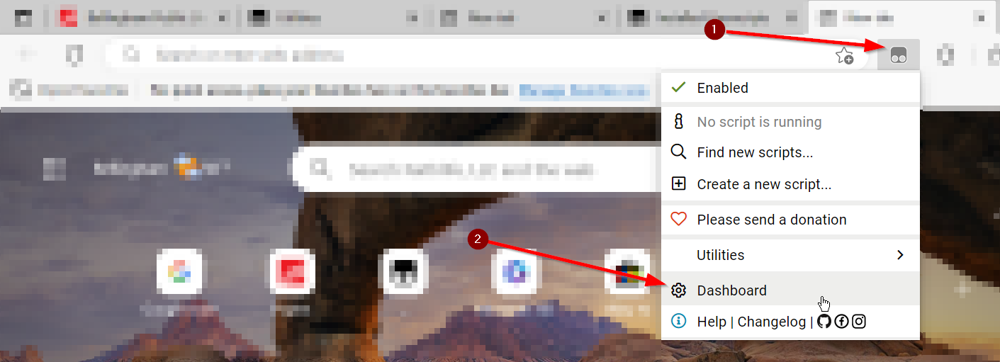
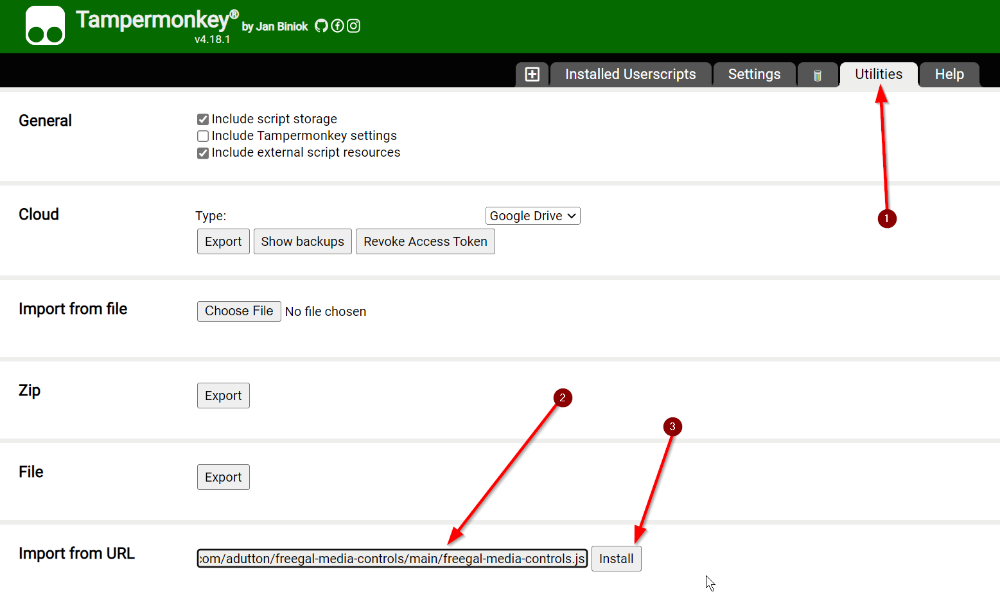
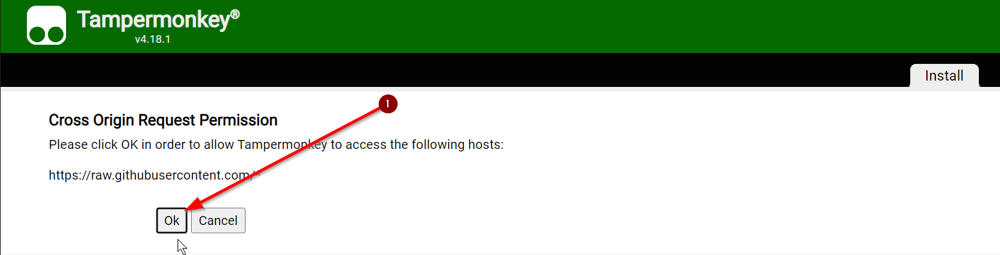

# freegal-media-controls
UserScript that adds media button (next, prev) and music metadata support to Freegal

# Motivation

I love Freegal and use the streaming music service from my local public library.  Unfortunately, the web player does not respond to some media buttons on my bluetooth remote or my keyboard.  Particularly the `Prev Track` and `Next Track` didn't work.  Since I use the music while out of reach of the computer, it is then impossible to skip a song.  I searched the internet for something that would provide the functionality but nothing covered Freegal.  I did attempt to modify some Chrome extensions that added support to other web players but I didn't have any success.  Frustrated, I wrote this small piece of JavaScript to fix it. I use TamperMonkey to make it take effect everytime I load freegalmusic.com.

While I was learning about the media buttons, I figured out that I can manipulate the music metadata that is shown in Windows.  That was a quick add, although I had to introduce a small delay because it was initially firing an update before the webpage had a chance to respond.

# Installation

1. Install [TamperMonkey](https://www.tampermonkey.net/index.php) browser extension
2. Open the `⚙️ Dashboard`

    

3. Click on the `Utilities` tab
4. Under `Import from URL`, paste the URL for the raw contents of the script:

    ```
    https://raw.githubusercontent.com/adutton/freegal-media-controls/main/freegal-media-controls.js
    ```
  
    and click `Install`

    

5. Approve the `Cross Origin Request Permission`

    

6. Script is installed

# Release Notes

## 1.0 Initial Release

* Supports prev/next buttons
* Updates music metadata upon changes
* Known issue: Does not take effect until a play button is pressed manually and the player is visible
* Known issue: There is a small delay in updating the metadata
